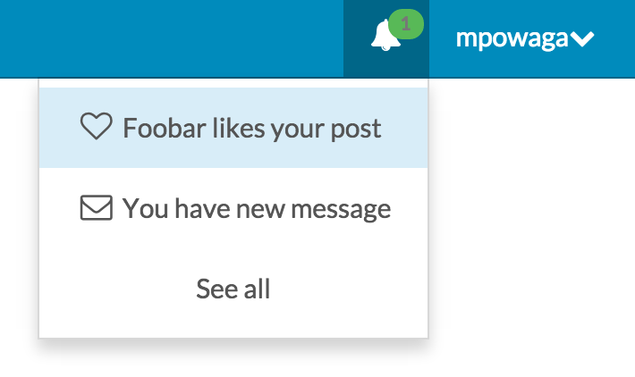

Meteor Notifications
====================

Easy notification functionality in meteor.

    meteor add yogiben:notifications

[See a demo](http://yogiben-favorites.meteor.com/dashboard)

### Screenshots ###



### Usage ###

1. Install the package

2. Put `notificationsDropdown` template in your navigation bar

        {{> notificationsDropdown}}

3. Create new notification

        Notifications.new({ title: 'New message', link: '/messages/1' });


### Helpers ###

#### Notification list ####

``{{Notifications limit=0 unreadFirst=false}}``

Lists all user notifications with specified ``limit`` (0 means no limit). If ``unreadFirst`` is true then unread notifications are listed first. Results are sorted by date in descending order (i.e. newest first).

Above parameters are optional and defaulted to ``0`` and ``false`` respectively.

#### Notification count ####

    {{notificationCount}}

This will return unread user notifications.

### Templates ###

#### Notifications dropdown ####

    {{> notificationsDropdown icon='bell' iconEmpty='bell-o'}}

This template can be used with bootstrap dropdown like this:

```html
<nav class="navbar navbar-default">
  <div class="collapse navbar-collapse">
    <ul class="nav navbar-nav navbar-right">
      {{> notificationsDropdown icon='envelope' iconEmpty='envelope-o'}}
    </ul>
  </div>
</nav>
```

``icon`` and ``iconEmpty`` parameters are font-awesome icon class names without prefix (``fa-`` is prepend automaticaly). If user has 0 unread notifications ``iconEmpty`` is used otherwise ``icon``.

Above parameters are optional and defaulted to ``'bell'`` and ``'bell-o'`` respectively.

#### Notification listing ####

    {{> notifications}}

This is simple bootstrap panel with listing of all user notifications.

### Notifications object ###

#### Creating new notification ####

```js
Notifications.new
  title: 'New message'
  link: '/messages/1'
  icon: 'bolt'
  class: 'default'
```

This method inserts new notification into ``Notifications`` collection.

``title`` and ``link`` are used to create link to notification.

``icon`` is font-awesome icon class name displayed with in notification link.

``class`` is bootstrap 3 ``bg-`` class and can be one of ``primary success info danger`` (note: you don't need to specify prefix).

``read`` is notification state. Defaulted to ``false``.

``owner`` is user id. Defaulted to ``Meteor.userId()``.

``date`` is current date.

#### Reading notifications ####

You can set all notifications as read with:

    Notifications.readAll()

or set only one by id:

    Notifications.read _id

### Customising ###

You can created your own buttons and replace the default templates. To do this, you should use the separate [template-extension](https://github.com/aldeed/meteor-template-extension) package.

1) Install with `meteor add aldeed:template-extension`

2) Create new button templates based on this markup

```html
<template name="myNotificationsDropdown">
  <div class="btn-group">
    <button class="btn btn-default dropdown-toggle" data-toggle="dropdown">
      <i class="fa fa-bell"></i>
    </button>
    <ul class="dropdown-menu" role="menu">
      {{#each Notifications limit=5 readFirst=true}}
        <li><a href="{{link}}" class="bg-{{class}}"><i class="fa fa-{{icon}}"></i>{{title}}</a></li>
      {{/each}}
    </ul>
  </div>
</template>

<template name="myNotifications">
  <ul class="notification-list">
    {{#each Notifications}}
      <li>
        <a href="{{link}}" class="bg-{{class}}"><i class="fa-{{icon}}"></i> {{title}}</a>
      </li>
    {{/each}}
  </ul>
</template>
```

3) Replace the existing button templates with the `replace` method provided by the package

```js
Template.myNotificationsDropdown.replaces("notificationsDropdown")

Template.myNotifications.replaces("notifications")
```
